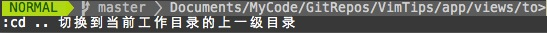

vim-tips
========

A vim plugin to show tips of vim in Vim editor.

##Requirement
Need ruby environment.
##Install
Use Vundle to install this plugin:
* Modify .vimrc file
* Add one line:
```
Bundle 'TimothyYe/vim-tips'
```
* Save .vimrc file, start vim, install this plugin using:
```
:BundleInstall
```
##Usage
In Vim, use ":VimTips" to get and show one random vim tip:

